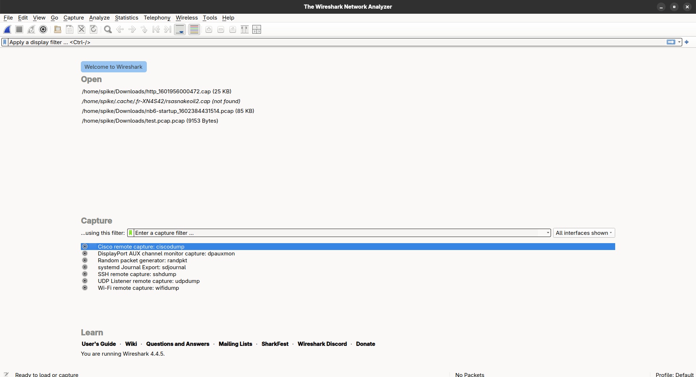
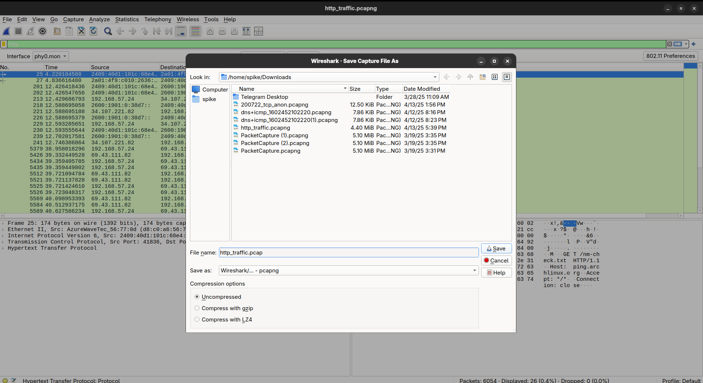

# Solution: Beginner Challenge 1 - Capture HTTP Traffic

This guide walks you through capturing and filtering HTTP traffic in Wireshark, with screenshots to clarify each step. Follow along to complete [Challenge 1](../challenge_1.md).

## Objective
Capture HTTP packets from a website visit and filter them in Wireshark.

## Prerequisites
- Wireshark installed ([download](https://www.wireshark.org/download.html)).
- A web browser (e.g., Firefox, Chrome).
- Network access (Wi-Fi or Ethernet).

## Step-by-Step Solution

### 1. Open Wireshark
Launch Wireshark. You’ll see the main interface with a list of network interfaces.

### 2. Select Your Interface
Choose the active network interface (e.g., `Wi-Fi` or `eth0`). Look for one with packet activity (spiking graph). Double-click to select it.

**Troubleshooting**:
- **Issue**: No interfaces listed.
- **Fix**: Install Npcap (Windows) or ensure Wireshark has capture permissions (`sudo wireshark` on Linux).

### 3. Start Capture
Click the blue shark fin (or press `Ctrl+E`) to begin capturing packets. You’ll see packets streaming in.

### 4. Apply HTTP Filter
In the filter bar, type `http` and press Enter. This shows only HTTP packets, hiding others like TCP or DNS.

**Troubleshooting**:
- **Issue**: No packets after filtering.
- **Fix**: Ensure you’re using `http` (lowercase) and generating traffic (Step 5).

### 5. Generate HTTP Traffic
Open a browser and visit http://example.com (use HTTP, not HTTPS, for simplicity). This generates HTTP packets, like GET requests.

### 6. Stop and Save Capture
Click the red square (or `Ctrl+E`) to stop capturing. Save the capture via `File > Save As`, naming it `http_traffic.pcap` in the `pcaps/` folder.

## Sample PCAP
Download the resulting PCAP: [http_traffic.pcap](../../../pcaps/http_traffic.pcap).

## Analysis
Inspect the captured packets:
- Look for `GET / HTTP/1.1` requests in the Packet Details pane.
- Check the source IP (your device) and destination IP (example.com’s server).
- Use `Statistics > Protocol Hierarchy` to confirm HTTP traffic.

## Common Issues and Fixes
- **Issue**: Captured HTTPS instead of HTTP.
  - **Fix**: Use http://example.com, not https://.
- **Issue**: Filter shows no results.
  - **Fix**: Clear filter (`Ctrl+/`) to check if packets were captured, then reapply `http`.

## Learning Outcomes
- **Filters**: Applied `http` to isolate traffic.
- **Packets**: Identified HTTP GET requests.
- **Saving**: Exported a PCAP for later analysis.

## Bonus
- Try filtering for `http.request.method == GET` to see only GET requests.
- Export HTTP objects (`File > Export Objects > HTTP`) to view downloaded files.

---

Back to [Challenge 1](../challenge_1.md) | [All Challenges](../../../README.md#challenges)
